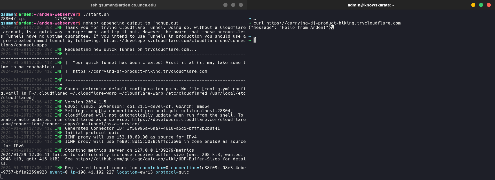

# arden-webserver

Arden is a Linux machine hosted by the UNCA CS department for student use. It is intended for students to ssh into for systems programming courses. This repo uses cloudflare's DNS tunnelling library `cloudflared` to get a basic Python server onto the internet, while running on Arden.


Students are pretty restricted in what they can do on Arden, so `cloudflared` needs to be built from source, using Go. The /cloudflared directory should be a fully functional build. This idea screams as a use case for something like Docker, but building Docker from source to get it on the machine seems more cumbersome.

To install, run:

```bash
git clone https://github.com/givensuman/arden-webserver
```
while you have an ssh connection to Arden. Then,

```bash
cd arden-webserver && ./start.sh
```
will get you up and running. By default the Python server runs on port 28804 (UNCA zip code). You will see a UUID CloudFlare domain logged in your terminal:

```
INF Requesting new quick Tunnel on trycloudflare.com...
INF +--------------------------------------------------------------------------------------------+
INF |  Your quick Tunnel has been created! Visit it at (it may take some time to be reachable):  |
INF |  https://<UUID>.trycloudflare.com                                 |
INF +--------------------------------------------------------------------------------------------+
```

To get a persistent domain, you have to configure a domain you own to use CloudFlare DNS, and generate a `cert.pem` file, which I guess has a PGP key or something. You can follow [these instructions](https://developers.cloudflare.com/cloudflare-one/connections/connect-networks/get-started/create-local-tunnel/) to do that.




